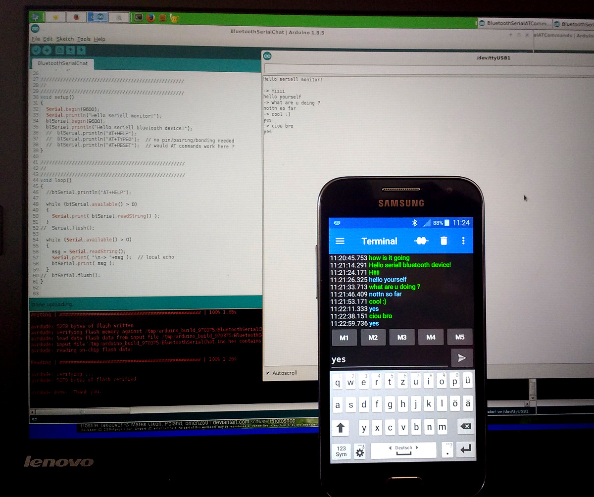
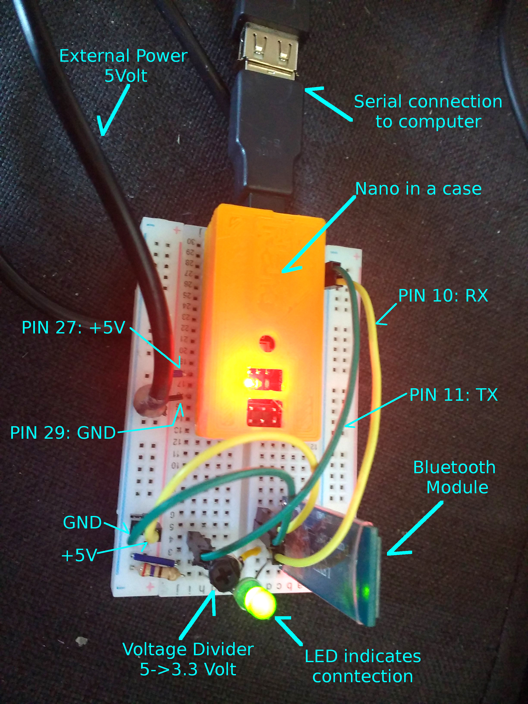

# Arduino Nano Bluetooth Chat
Serial chat between arduino nano and mobile phone using CC2541BLE bluetooth board. 

## Hardware

* module

* wiring

* voltages 5 -> 3.3

datasheet: http://duinopeak.com/wiki/images/c/cd/Bluetooth4_en.pdf
datasheet: http://img.banggood.com/file/products/20150104013200BLE-CC41-A_AT%20Command.pdf

## Software

### Arduino
### Serial Bluetooth Terminal

https://play.google.com/store/apps/details?id=de.kai_morich.serial_bluetooth_terminal

## License
Distributed under the Apache License Version 2.0.

## References

* https://www.heise.de/developer/artikel/Bluetooth-Auf-den-blauen-Zahn-gefuehlt-3361763.html
* https://create.arduino.cc/projecthub/achindra/bluetooth-le-using-cc-41a-hm-10-clone-d8708e
* http://nerdclub-uk.blogspot.co.at/2016/02/working-with-cheap-bluetooth-btle4.html
* http://img.banggood.com/file/products/20150104013200BLE-CC41-A_AT%20Command.pdf
* http://www.martyncurrey.com/bluetooth-modules/
* http://www.martyncurrey.com/hm-10-bluetooth-4ble-modules/
* https://www.elv.de/Bluething-Board-Daten%C3%BCbertragung-per-Bluetooth-zwischen-Arduino-Nano-und-Smartphone,-PC-oder-einem-anderen-Arduino-Nano/x.aspx/cid_726/detail_61762

http://www.kai-morich.de/android/ble_troubleshooting.html

* https://play.google.com/store/apps/details?id=de.kai_morich.serial_bluetooth_terminal
* http://www.circuitstoday.com/arduino-nano-tutorial-pinout-schematics

## Authors:

* quirxi (https://github.com/quirxi)
