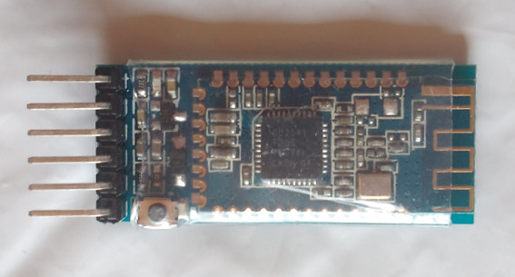
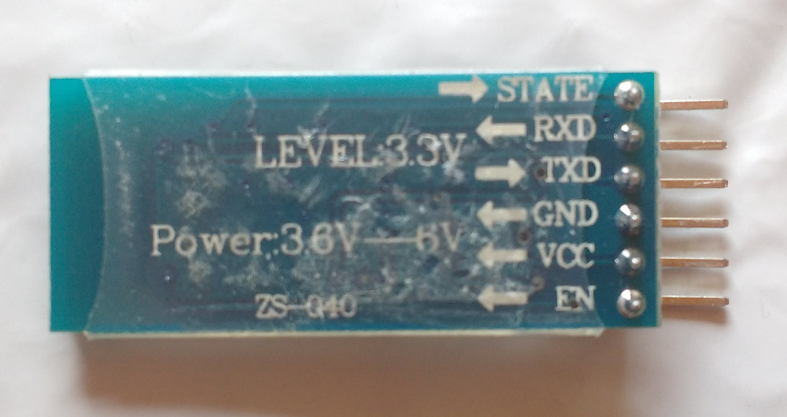

# Arduino Nano Bluetooth Chat
Serial chat between arduino nano and mobile phone using CC2541BLE bluetooth board. 

## Hardware

I bought a Bluetooth 4.0 BLE module on [www.aliexpress.com](https://www.aliexpress.com/item/Android-IOS-BLE-Bluetooth-4-0-HM-10-CC2540-CC2541-6Pin-Serial-Wireless-Module-DC-5V/32837215626.html) and realized that it was not an original HM-10 module but a clone with a CC2541 chip on it.
But that did not really matter to me at that time because I had no clue what the difference was anyway.
These clones have a sort of slightly different/limited AT command set. 
You can find the datasheet of the original chip [here](http://duinopeak.com/wiki/images/c/cd/Bluetooth4_en.pdf) and a datasheet of the clone [here](http://img.banggood.com/file/products/20150104013200BLE-CC41-A_AT%20Command.pdf).
I have also added these datasheets to this github repository.

 

### Wiring

|      Nano   |  Bluetooth |
|-------------|------------|
| PIN 10 (RX) |    TXD     |
| PIN 11 (TX) |    RXD     |
| PIN 27 (+5V)|    VCC     |
| PIN 29 (GND)|    GND     |

I connected the *state pin* of the bluetooth module to a LED, which indicates clearly when a mobile phone is connected. 

**One word about voltage levels of the bluetooth module:**
Even when you can supply the module with 3.6 to 6 volt the voltage *output level* of the module is *3.3* volt.
Some people on the internet hooked the TRX pin up to 5 volts and it seemed not to harm the module. 
I made a voltage divider out of a small 2K potentiometer that reduced the 5 volt of the arduino TX pin 11 to 3.3 volts.
The bigger problem was that the arduino nano did not always recognize the 3.3 volt input of the bluetooth module on it's RX pin 10.
When I measured the voltages I realized that the voltages were not 5 volt from the nano but 4.6 volt and the 3.3 volt of the bluetooth module were in fact 3.1 volt.
Probably that was not enought to be recognized as high on the nano RX pin 10 and so the communication only worked in one direction.
So I hooked up an external stabilized power supply on pin 27 of the nano and VCC of the bluetooth module and everything worked as expected.
I think it would probably the best to power the arduino and the bluetooth module both with stablized 3.3 volt from an external power supply.
Also keep in mind that the output of the bluetooth module is 3.3 volt when you calculate the resistor for the status LED.

  

## Software

### Arduino
### Serial Bluetooth Terminal
I used [this serial bluetooth terminal](https://play.google.com/store/apps/details?id=de.kai_morich.serial_bluetooth_terminal) from [Kai Morich](http://www.kai-morich.de/android/). 
It was the only bluetooth terminal I found that was able to handle the BLE 4.0 paring without PIN.
It seems as if there is still mismatch between what the standard says and how it is implemented by different chip producers and how it is handled by software like android for example.
You can read more about that and how to troubleshoot it [here](http://www.kai-morich.de/android/ble_troubleshooting.html).

## Troubleshooting
* voltages 5 -> 3.3: voltage divider // output only 3.3 level->can lead to flaky readings bad connections
* communication at commands when two consoles are connected
* pin no pin 

## Code

## License
Distributed under the Apache License Version 2.0.

## References

* https://www.heise.de/developer/artikel/Bluetooth-Auf-den-blauen-Zahn-gefuehlt-3361763.html
* https://create.arduino.cc/projecthub/achindra/bluetooth-le-using-cc-41a-hm-10-clone-d8708e
* http://nerdclub-uk.blogspot.co.at/2016/02/working-with-cheap-bluetooth-btle4.html
* http://img.banggood.com/file/products/20150104013200BLE-CC41-A_AT%20Command.pdf
* http://www.martyncurrey.com/bluetooth-modules/
* http://www.martyncurrey.com/hm-10-bluetooth-4ble-modules/
* https://www.elv.de/Bluething-Board-Daten%C3%BCbertragung-per-Bluetooth-zwischen-Arduino-Nano-und-Smartphone,-PC-oder-einem-anderen-Arduino-Nano/x.aspx/cid_726/detail_61762
* http://www.kai-morich.de/android/ble_troubleshooting.html
* https://play.google.com/store/apps/details?id=de.kai_morich.serial_bluetooth_terminal
* http://www.circuitstoday.com/arduino-nano-tutorial-pinout-schematics

## Authors:

* quirxi (https://github.com/quirxi)
